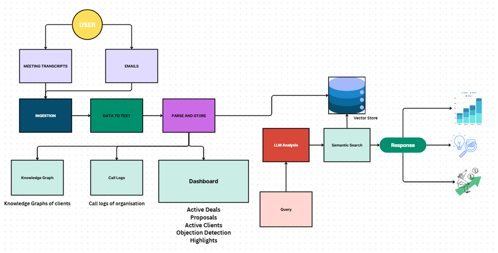

## SalesMind
SalesMind is a GenAI-powered analytics system that helps organization analyze sales call transcripts, identify active deals, track competitors, and summarize key meeting outcomes - all through AI Agents (OpenAI Agents SDK), Retrieval-Augmented Generation (RAG) and Knowledge Graphs. It uses Django as its web interface.

The platform enables sales leaders to:

- Query transcript records
- Identify trending projects and proposals
- Track objections (pricing, feasibility, timeline, etc.)
- Discover competitor mentions
- View deal highlights and sales metrics
- Explore an interactive dashboard summarizing all deals and performance KPIs

## Directory Structure
 - SalesMind
    - salesmind_app : Main app
        - static:   [css, js-scripts, data{json-files}]
        - templates: All the html files
        - upload_transcripts: Files related to data ingestion, query. 

    - Transcripts_data : The transcripts files of all the calls.
    - manage.py

## Flow: 

## Steps to run:
    1. Clone the repo
    2. Create a python/conda environment
    3. Activate the environment
    4. Navigate to the SalesMind folder in terminal and install the dependencies in your created environment using: pip install -r requirements.txt
    5. Open two terminals, ensure the environment is activated in both and execute the below mentioned scripts.
        - Terminal 1: python manage.py runserver
        - Terminal 2: python manage.py watch_new_files
    6. Open the application using port specified in the terminal. Example (http://127.0.0.1:8000)

## Screenshots
### Dashboard page:

### AI Assistant

### Call Logs 

### Knowledge Graph

### File Upload

    
